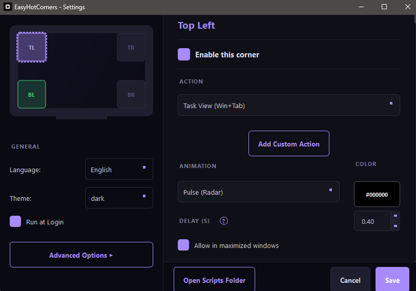
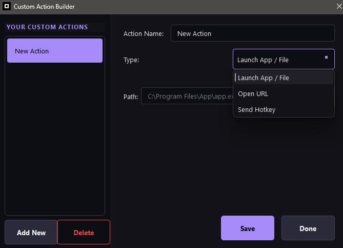

# EasyHotCorners


A lightweight, modular hot corner manager for Windows 11. Assign actions to any corner of your screen and trigger them by moving your mouse to that corner, with animated feedback and full per-corner customization.

**[Official Website](https://easy-hot-corners.vercel.app/)**

---

## Screenshots

| Settings Window | Action Builder |
|---|---|
|  |  |

---

## Features

- **Four independent hot corners** — Top Left, Top Right, Bottom Left, Bottom Right, each fully configurable.
- **Animated overlay** — Four distinct animation styles rendered at up to 60 fps: Arc, Corner Bar, Pulse, and Fade Box.
- **Custom animation color** — Choose any color per corner via a built-in color picker.
- **Configurable delay** — Set how long the mouse must dwell in a corner before the action fires (0.1 s – 5.0 s).
- **System Tray integration** — The application lives in the Windows system tray. No persistent window is shown while idle.
- **Smart Window suppression** — Hot corners are automatically suppressed when a fullscreen application is active. Activation in maximized applications can be toggled on or off individually per corner.
- **Action Builder** — Create custom actions visually from the settings UI: launch any application, open a URL, or send keyboard hotkeys. No coding required.
- **Custom Python scripts** — Drop any `.py` file into the scripts folder and it will appear as a selectable action inside the settings window. Fully compatible with the Action Builder.
- **Update system** — Background update check at startup, clickable tray notification, in-app download with progress bar, and auto-install.
- **Version display** in the tray menu.
- **Multi-Monitor Support** — Hot corners can span seamlessly across all connected screens.
- **Advanced Optimization** — Customize the trigger area radius (pixels) and fine-tune the CPU polling interval for ultimate performance control.
- **Premium User Interface** — A completely redesigned Settings UI with inline tooltips, live apply, and Light/Dark themes.
- **Theme support** — Dark, Light, or automatic System theme (reads the Windows registry).
- **Language support** — English and Spanish, selectable from the settings window with immediate retranslation.

### Built-in Actions (24 total)

| Category | Actions |
|---|---|
| Desktop | Toggle Desktop Icons, Show Desktop (Win+D) |
| System | Lock Screen, Task Manager, Turn Off Display, Open File Explorer |
| Volume | Mute / Unmute, Volume Up, Volume Down |
| Media | Play / Pause, Next Track, Previous Track |
| Windows | Start Menu, Task View (Win+Tab), Quick Settings (Win+A), Notifications (Win+N), Widgets (Win+W) |
| Virtual Desktops | Next Virtual Desktop, Previous Virtual Desktop |
| Utilities | Run Dialog (Win+R), Snip & Sketch (Win+Shift+S), Clipboard History (Win+V), Emoji Panel (Win+.) |
| Custom | Action Builder (launch apps, URLs, hotkeys), Python scripts |

---

## Requirements

- Windows 10 or Windows 11
- Python 3.10 or later
- The packages listed in `requirements.txt`

Install dependencies:

```
pip install -r requirements.txt
```

---

## Running from Source

```
python main.py
```

The application starts silently in the system tray. Right-click the tray icon to open Settings or quit.

---

## Building a Standalone Executable

1. Install PyInstaller:
   ```
   pip install pyinstaller
   ```
2. Run the build command:
   ```
   pyinstaller --noconfirm --onefile --windowed --icon="icon.ico" --name="EasyHotCorners" --add-data "icon.ico;." main.py
   ```
3. The finished executable will be at `dist/EasyHotCorners.exe`.

---

## Configuration

All settings are stored in `%APPDATA%\EasyHotCorners\settings.json` and are edited through the graphical settings window. No manual JSON editing is required.

| Setting         | Description                                                          |
| --------------- | -------------------------------------------------------------------- |
| Language        | Interface language (English or Spanish).                             |
| Theme           | Color scheme: System (auto-detect), Dark, or Light.                  |
| Enable          | Toggle a corner on or off individually.                              |
| Allow Maximized | Allow hot corner triggers even if a window is maximized (optional).   |
| Action          | Built-in action, custom action, or custom script to execute.         |
| Animation       | Visual style shown while dwelling in the corner.                      |
| Color           | Color of the animation overlay.                                      |
| Delay           | Dwell time in seconds before the action fires.                       |

---

## Custom Scripts

Place any `.py` file in `%APPDATA%\EasyHotCorners\scripts\`. It will appear automatically as a selectable action in the settings window. Scripts are executed in a new process explicitly using the system's `python` interpreter.

> [!IMPORTANT]
> **Python Required**: To execute custom `.py` scripts, you must have Python installed on your system and added to your environment variables (PATH).

An `easy_api.py` helper file is generated in the same scripts folder on first launch. It can be imported from your own scripts and edited freely.

Example structure:

```
%APPDATA%\EasyHotCorners\
    settings.json
    scripts\
        easy_api.py
        my_custom_action.py
```

---

## Action Builder

The Action Builder lets you create custom actions without writing any Python code:

- **Launch App / File** — Pick any executable or document on your system.
- **Open URL** — Opens a website in your default browser.
- **Send Hotkey** — Simulate any keyboard shortcut (Ctrl+C, Win+D, etc.).

Open the Action Builder from the Settings window by clicking **"Add Custom Action"**. Your custom actions appear alongside the built-in ones in the action dropdown.

---

## Project Structure

| File                 | Purpose                                                     |
| -------------------- | ----------------------------------------------------------- |
| `main.py`            | Application entry point, system tray, theme management.     |
| `engine.py`          | Mouse position polling at ~60 Hz, corner detection signals. |
| `overlay_ui.py`      | Transparent overlay window, animation rendering.            |
| `settings_ui.py`     | Configuration window built with PySide6.                    |
| `action_builder.py`  | Custom Action Builder dialog (launch apps, URLs, hotkeys).  |
| `config.py`          | Settings persistence (`%APPDATA%\EasyHotCorners`).          |
| `actions.py`         | Built-in action definitions and script execution.           |
| `i18n.py`            | English and Spanish translation strings.                    |
| `update_manager.py`  | GitHub release check and download logic.                    |
| `version.py`         | Centralized version string (`VERSION = "1.0.1"`).           |
| `download_dialog.py` | Download dialog with real progress bar and cancel support.  |
| `icon.svg`           | Application icon (source format).                           |
| `export.txt`         | PyInstaller build command reference.                        |
| `requirements.txt`   | Python dependency list.                                     |

---

## License

MIT
